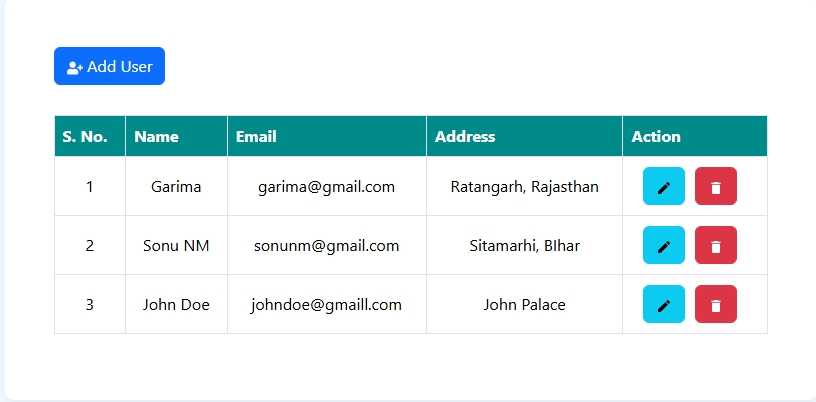
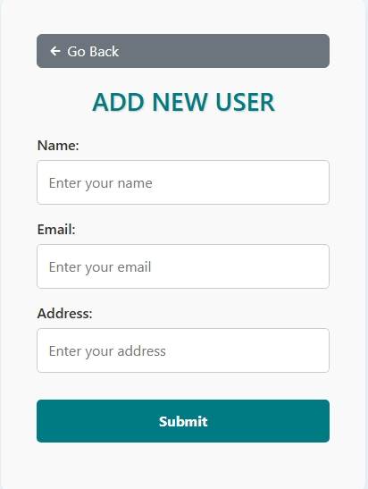
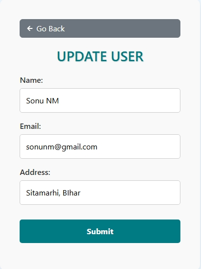

# Express.js: Understanding req.body and req.params

## Project Screenshots 📸



<div style="display: flex; justify-content: space-between;">
  
  
</div>


## 1. req.body ✨
`req.body` is used to access the data sent in the **body of the request**. This is typically used in **POST, PUT, and PATCH** requests when sending JSON, form data, or any payload.

### Usage:
- Requires middleware like `express.json()` or `body-parser` to parse incoming request bodies.

### Example:
```javascript
app.use(express.json()); // Middleware to parse JSON body

app.post('/api/user', (req, res) => {
    console.log(req.body);  // Access the data sent in the body
    const { name, email } = req.body;
    res.send(`User created: ${name}, ${email}`);
});
```

### Request Example (using Postman or frontend):
```
POST http://localhost:8000/api/user
Content-Type: application/json

{
  "name": "John Doe",
  "email": "john@example.com"
}
```

### Output:
```
{ "name": "John Doe", "email": "john@example.com" }
```

---

## 2. req.params 🔍
`req.params` is used to access **route parameters** from the URL. It is commonly used in **GET, PUT, and DELETE** requests to identify a resource.

### Example:
```javascript
app.get('/api/user/:id', (req, res) => {
    console.log(req.params);  // Access the URL parameters
    const userId = req.params.id;
    res.send(`Fetching user with ID: ${userId}`);
});
```

### Request Example:
```
GET http://localhost:8000/api/user/12345
```

### Output:
```
{ "id": "12345" }
```

---

## 🏆 Quick Comparison:
| **`req.body`** 📢  | **`req.params`** 📏 |
|--------------------|---------------------|
| Extracts data from the **request body**. | Extracts data from the **URL parameters**. |
| Used in POST, PUT, PATCH requests. | Used in GET, PUT, DELETE requests. |
| Requires middleware like `express.json()` or `body-parser`. | No middleware required. |
| Example: `req.body.name` | Example: `req.params.id` |

---

# req.params - extracting data with URL params

## 📌 Routes and Controllers

### 🟢 **Get User by ID**

**Route:**
```plaintext
GET /api/user/:id
```

**Description:** Fetches a user from the database by their ID.

**Example Request:**
```plaintext
GET http://localhost:8000/api/user/64a4b6c89b32
```

**How it Works:**
- `:id` is a **route parameter**. It is extracted from the URL using `req.params`.
- `req.params` is an object containing the route parameters:
```javascript
req.params = { id: '64a4b6c89b32' }
```
- Then, the `id` can be used to query the database:
```javascript
const id = req.params.id;
const userExists = await User.findById(id);
```
- If the user is found, their data is returned with a 200 status code.
- If not found, a 404 status code is sent with a "User not found!" message.

**Controller:**
```javascript
export const getUserById = async (req, res) => {
    try {
        const id = req.params.id; 
        const userExists = await User.findById(id);
        if (!userExists) {
            return res.status(404).json({
                message: 'User not found!'
            });
        }
        res.status(200).json(userExists);
    } catch (error) {
        res.status(500).json({
            message: error.message 
        });
    }
}
```

**Why Use `req.params`?**
- Makes the API **dynamic**.
- Instead of creating separate routes for every user, you use one route (`/user/:id`) and extract different IDs dynamically from the URL.

✅ **Example Response:**
```json
{
  "_id": "64a4b6c89b32",
  "name": "John Doe",
  "email": "john@example.com",
  "address": "123 Street, City"
}
```

---


